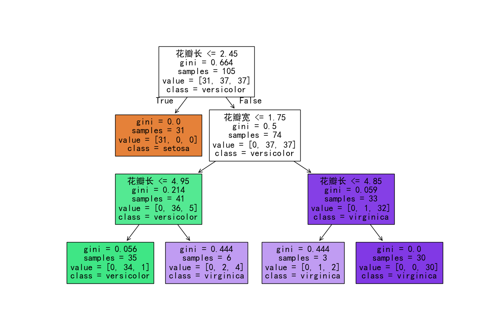
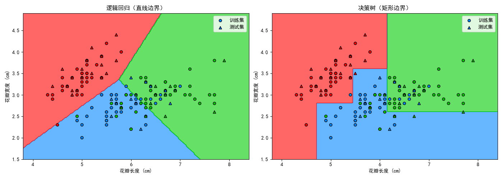
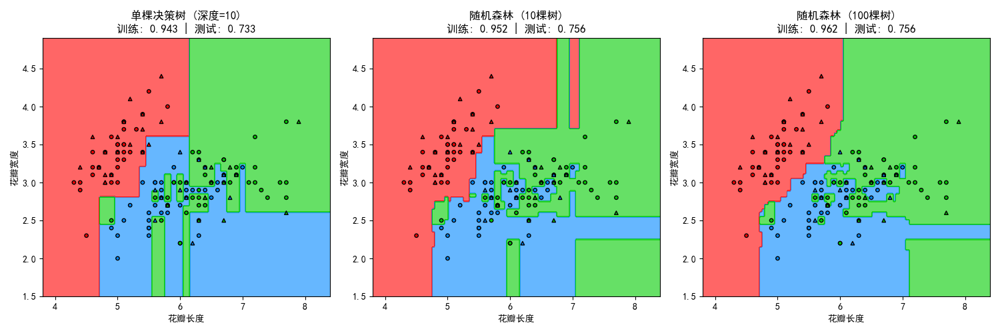
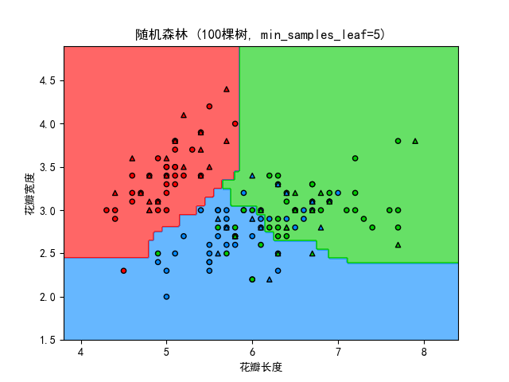
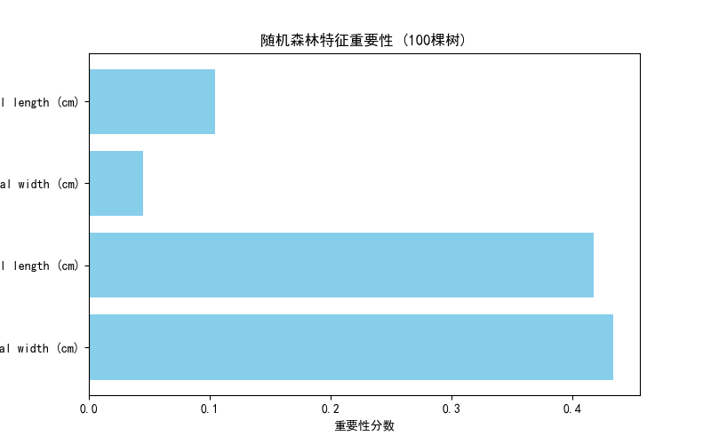

---

# 📓 机器学习第三课 · 完整笔记：决策树与随机森林

> **课程目标**：理解决策树的“连环问答”逻辑，掌握过拟合的成因及随机森林的解决思路，并能根据场景选择合适的分类模型。


## 1. 决策树的核心逻辑

### 通俗解释（猜人物游戏）

决策树的工作方式就像玩“20个问题”的游戏：
- 你心里想了一个东西，我通过不断问“是/否”的问题来猜。
- 每问一个问题，范围就缩小一点。
- 问到最后，答案就落在唯一的类别上。

### 专业解释

决策树通过一系列 **“特征 ≤ 阈值”** 的二值判断，将数据逐步划分到不同的叶子节点。每个节点只用**一个特征**和一个**阈值**。

**示例**：`花瓣长度 ≤ 2.45？` 是 → 山鸢尾；否 → 继续问下一个问题。

### 核心术语对照表

| 通俗说法 | 专业术语 |
| :--- | :--- |
| 连续问问题的次数 | `max_depth`（最大深度） |
| 每个“是/否”的判断点 | 节点（Node） |
| 最终的判断结果 | 叶子节点（Leaf） |
| 某个条件能把数据分得多干净 | 基尼系数（Gini）/ 信息增益 |


## 2. 决策树的决策边界（横平竖直）

### 通俗解释

决策树每问一个问题，就相当于在图上画一刀。问“花瓣长度 ≤ 2.45？”是**竖着切一刀**（只看横轴）；问“花瓣宽度 ≤ 1.75？”是**横着切一刀**（只看纵轴）。横一刀竖一刀拼起来，最后就成了横平竖直的矩形拼图。

### 专业解释

- 每个节点分裂只针对**单个特征**，因此分割边界始终平行于某个坐标轴。
- 多次分裂后，决策空间被划分为**轴平行矩形区域**。
- 这与逻辑回归的**斜线边界**（所有特征加权组合）形成本质区别。

### 与逻辑回归的边界对比

| 模型 | 边界形状 | 原因 |
| :--- | :--- | :--- |
| 逻辑回归 | 斜线 | 同时使用所有特征做加权组合 |
| 决策树 | 横平竖直的矩形 | 每个节点只看一个特征 |


## 3. 过拟合：为什么深度大了反而不好

### 通俗解释（猜人物游戏继续）

你被允许问 20 个问题。为了赢下今天的训练集，你问出了“这个人是不是和陈家驹有关？”这种极度定制的问题。
- 今天猜的对象是成龙 → 答案是“是”，你猜对了。
- 明天考试换了一个人（李连杰）→ 你依然问“和陈家驹有关吗？” → 答案是“否”，你顺着错误路径走下去，全盘皆输。

**结论**：问题问得越多、越细，你就越是在“记特例”，而不是在“学规律”。

### 专业解释

深度过大（如 `max_depth=10` 以上）允许树无限细分，直至为单个或极少数样本独立切出区域。此时模型记住的是训练集中的**噪声和特例**，而非**一般规律**。

**过拟合的判断标准**：训练准确率极高（如接近 1.0），测试准确率明显低于训练准确率。

### 实验验证结果

你在实验中得到的数据：
- 深度=3：训练 0.943，测试 0.733
- 深度=10：训练 0.952，测试 0.756
- 深度=20：训练准确率显著提高，测试准确率明显下降

这一现象直接验证了“深度越大 → 过拟合越严重”的规律。


## 4. 随机森林：如何解决过拟合

### 通俗解释（小组作业 vs 独立作业）

单棵树就像一个**极度聪明的独行侠**。他为了把作业做全对，会死扣题目的每个细节（比如“这道题里有个逗号，所以选 A”）。一考试就崩盘。

随机森林的做法是：**请 100 个学生，每人独立做作业，最后投票决定答案。** 但这 100 个人不能一模一样，必须让每个人看到的世界都略有不同。

**两个“随机”制造差异：**

1. **随机选样本**：每个人只看到一部分题目。甲看 1-70 题，乙看 20-90 题……就算某道题有异常（噪声），也不会所有人都记住它。

2. **随机选特征**：每个人做题时只能看到部分条件。甲只看“颜色”和“蒂把长度”，乙只看“形状”和“斑点数量”。这样每个人得出的结论会有天然差异。

**投票如何抹平噪声**：某个学生因为看到了“3 个斑点”这个极端细节而选了错答案，但其他 90 个学生根本没看到“斑点数量”这个条件，他们只靠“颜色”和“形状”判断，投了正确答案。最终投票结果是 90 票对 10 票，正确结果胜出。

### 专业解释

随机森林通过两种随机化手段降低方差（过拟合）：

| 随机化手段 | 专业术语 | 作用 |
| :--- | :--- | :--- |
| 随机选样本 | Bootstrap（有放回抽样） | 每棵树只训练约 2/3 的数据 |
| 随机选特征 | 特征子集（Feature Subspace） | 每个节点分裂时只考虑部分特征 |

投票（或平均）机制将多棵树的预测结果集成，抵消了单棵树因噪声产生的错误预测。


## 5. 关键参数速查表

| 参数名 | 通俗含义 | 专业解释 | 调参方向 |
| :--- | :--- | :--- | :--- |
| `max_depth` | 最多能连续问多少个问题 | 树的最大深度 | 越大越容易过拟合 |
| `n_estimators` | 请多少个学生来投票 | 树的数量 | 看测试准确率是否走平 |
| `min_samples_leaf` | 一片叶子上至少坐几个人 | 叶子节点最少样本数 | 调大 → 避免“单间” |
| `random_state` | 固定“运气” | 随机种子 | 保证结果可复现 |


## 6. `min_samples_leaf` 的单独解释

### 通俗解释

默认 `min_samples_leaf=1`，相当于允许“一片叶子上只坐 1 个人”。树就会抓住那些离群的噪声点，单独给它们切出一个“单间”来讨好它。

你把值调成 5 后，规则变成“每片叶子至少坐 5 个人”。树如果想把那个离群点单独切出来，切完后那片叶子上只有 1 个人——违规，切不了。于是树只能放弃，把噪声点留在附近的大区域里。

**效果**：边界上极小的“单间”消失，决策边界更平滑，泛化能力更好。

### 专业解释

`min_samples_leaf` 控制了树分裂的**最低粒度**。较大的值会限制树在数据稀疏区域继续分裂，从而减少过拟合。


## 7. 特征重要性（Feature Importance）

### 通俗解释

随机森林里有很多棵树，每个特征（花瓣长度、花瓣宽度等）都会被用来提问。特征重要性统计的是：**这个特征在所有树中被用来提问的次数占比**。

- 如果某个特征被频繁用作判断依据 → 它对分类非常重要，分数高。
- 如果几乎不用 → 它对分类没太大帮助，分数低。

### 你运行得到的结果

```
特征重要性排序（从高到低）：
  花瓣长度: 0.42
  花瓣宽度: 0.41
  花萼长度: 0.10
  花萼宽度: 0.07
```

花瓣长 + 花瓣宽 ≈ 0.83（83%），花萼特征只占约 17%。

**结论**：在这组数据里，靠花瓣的特征就完成了 80% 的分类工作，花萼只是锦上添花。

### 专业解释

`model.feature_importances_` 基于**基尼系数减少量**或**信息增益**的累积计算。一个特征被用于分裂的次数越多、且分裂后纯度提升越大，其重要性分数越高。


## 8. 三个模型的应用场景对比

| 维度 | 逻辑回归 | 单棵决策树 | 随机森林 |
| :--- | :--- | :--- | :--- |
| **擅长关系** | 线性 | 非线性，但极不稳定 | 复杂非线性，稳定 |
| **解释性** | ⭐⭐⭐⭐⭐（直接看权重） | ⭐⭐⭐⭐⭐（流程图） | ⭐⭐（几百棵树没法看） |
| **数据量** | 几千~几万条 | 任意，但易过拟合 | 几万条以上效果最佳 |
| **对异常值/噪声** | 敏感 | 敏感 | 不敏感 |
| **训练速度** | 极快 | 快 | 较慢 |
| **典型场景** | 金融评分、医疗风险 | 规则提取、EDA | 推荐、欺诈检测、生物信息 |


## 9. 代码索引及文件头注释

以下代码文件已在课堂中生成。每个文件的第一行注释说明了其展示目的。

---

### `04_decision_tree\HelloDecisionTree.py`

**目的**：绘制单棵决策树的结构图，直观看到“连环问答”的流程。

```python
# 目的: 绘制决策树结构图，展示每个节点的"是/否"判断路径

import matplotlib
matplotlib.use('TkAgg')

import numpy as np
import matplotlib.pyplot as plt
from sklearn.datasets import load_iris
from sklearn.tree import DecisionTreeClassifier, plot_tree
from sklearn.model_selection import train_test_split

plt.rcParams['font.sans-serif'] = ['SimHei', 'Microsoft YaHei', 'STSong']
plt.rcParams['axes.unicode_minus'] = False

# 加载数据
iris = load_iris()
X = iris.data[:, :2]
y = iris.target

# 切分
X_train, X_test, y_train, y_test = train_test_split(X, y, test_size=0.3, random_state=42)

# 训练（深度限制为3）
model = DecisionTreeClassifier(max_depth=3, random_state=42)
model.fit(X_train, y_train)

# 绘制树结构
plt.figure(figsize=(12, 8))
plot_tree(model, feature_names=['花瓣长', '花瓣宽'], class_names=iris.target_names, filled=True)
plt.show()
```
**结果**：


---

### `04_decision_tree\DecisionTreeOverfit.py`

**目的**：对比不同深度（深度=3 vs 深度=10/20）的过拟合程度，观察训练/测试准确率的差异。

```python
# 目的: 对比不同深度（深度=3 vs 深度=10/20）的过拟合程度，观察训练/测试准确率的差异

import matplotlib
matplotlib.use('TkAgg')
---

### `04_decision_tree\DecisionTreeCompareLogisticRegression.py`

**目的**：对比决策树（横平竖直的矩形边界）和逻辑回归（斜线边界）的差异。

```python
# 目的: 并排展示决策树（矩形边界）与逻辑回归（斜线边界）的决策区域对比

import matplotlib
matplotlib.use('TkAgg')

import numpy as np
import matplotlib.pyplot as plt
from sklearn.datasets import load_iris
from sklearn.linear_model import LogisticRegression
from sklearn.tree import DecisionTreeClassifier
from sklearn.model_selection import train_test_split
from matplotlib.colors import ListedColormap

plt.rcParams['font.sans-serif'] = ['SimHei', 'Microsoft YaHei', 'STSong']
plt.rcParams['axes.unicode_minus'] = False

iris = load_iris()
X = iris.data[:, :2]
y = iris.target
X_train, X_test, y_train, y_test = train_test_split(X, y, test_size=0.3, random_state=42)

model_lr = LogisticRegression(max_iter=1000)
model_lr.fit(X_train, y_train)

model_tree = DecisionTreeClassifier(max_depth=3, random_state=42)
model_tree.fit(X_train, y_train)

def plot_decision_boundary(ax, model, title):
    x_min, x_max = X[:, 0].min() - 0.5, X[:, 0].max() + 0.5
    y_min, y_max = X[:, 1].min() - 0.5, X[:, 1].max() + 0.5
    xx, yy = np.meshgrid(np.arange(x_min, x_max, 0.02),
                         np.arange(y_min, y_max, 0.02))
    Z = model.predict(np.c_[xx.ravel(), yy.ravel()])
    Z = Z.reshape(xx.shape)
    colors = ['#FF0000', '#0088FF', '#00CC00']
    cmap = ListedColormap(colors)
    ax.contourf(xx, yy, Z, alpha=0.6, cmap=cmap)
    ax.scatter(X_train[:, 0], X_train[:, 1], c=y_train, cmap=cmap, edgecolor='k', s=20)
    ax.scatter(X_test[:, 0], X_test[:, 1], c=y_test, cmap=cmap, marker='^', edgecolor='k', s=20)
    ax.set_xlabel('花瓣长度')
    ax.set_ylabel('花瓣宽度')
    ax.set_title(title)

fig, (ax1, ax2) = plt.subplots(1, 2, figsize=(14, 5))
plot_decision_boundary(ax1, model_lr, '逻辑回归（斜线边界）')
plot_decision_boundary(ax2, model_tree, '决策树（矩形边界）')
plt.tight_layout()
plt.show()
```
**结果**：

---

### `04_decision_tree\DecisionTreeOverfit.py`

**目的**：对比不同深度（深度=3 vs 深度=10/20）的过拟合程度，观察训练/测试准确率的差异。

```python
# 目的: 演示深度（max_depth）如何影响过拟合。深度越大，训练准确率越高，测试准确率可能越低。

import matplotlib
matplotlib.use('TkAgg')

import numpy as np
import matplotlib.pyplot as plt
from sklearn.datasets import load_iris
from sklearn.tree import DecisionTreeClassifier
from sklearn.model_selection import train_test_split
from matplotlib.colors import ListedColormap

plt.rcParams['font.sans-serif'] = ['SimHei', 'Microsoft YaHei', 'STSong']
plt.rcParams['axes.unicode_minus'] = False

iris = load_iris()
X = iris.data[:, :2]
y = iris.target
X_train, X_test, y_train, y_test = train_test_split(X, y, test_size=0.3, random_state=42)

model_shallow = DecisionTreeClassifier(max_depth=3, random_state=42)
model_shallow.fit(X_train, y_train)

model_deep = DecisionTreeClassifier(max_depth=20, random_state=42)
model_deep.fit(X_train, y_train)

def plot_decision_boundary(ax, model, title):
    # ...（与上一段相同，略）
```
**结果**：
---

### `04_decision_tree\HelloRandomForest.py`

**目的**：对比单棵树、随机森林（10棵树）、随机森林（100棵树）的分界线与准确率，展示投票如何平滑边界。

```python
# 目的: 对比单棵树 vs 随机森林（10棵 vs 100棵），展示投票机制如何抹平"单间"、稳定边界

import matplotlib
matplotlib.use('TkAgg')

import numpy as np
import matplotlib.pyplot as plt
from sklearn.datasets import load_iris
from sklearn.tree import DecisionTreeClassifier
from sklearn.ensemble import RandomForestClassifier
from sklearn.model_selection import train_test_split
from matplotlib.colors import ListedColormap

plt.rcParams['font.sans-serif'] = ['SimHei', 'Microsoft YaHei', 'STSong']
plt.rcParams['axes.unicode_minus'] = False

iris = load_iris()
X = iris.data[:, :2]
y = iris.target
X_train, X_test, y_train, y_test = train_test_split(X, y, test_size=0.3, random_state=42)

model_tree = DecisionTreeClassifier(max_depth=10, random_state=42)
model_tree.fit(X_train, y_train)

model_rf_10 = RandomForestClassifier(n_estimators=10, max_depth=10, random_state=42)
model_rf_10.fit(X_train, y_train)

model_rf_100 = RandomForestClassifier(n_estimators=100, max_depth=10, random_state=42)
model_rf_100.fit(X_train, y_train)

# ... 画图逻辑与之前相同，并输出训练/测试准确率
```
**结果**：
---

### `04_decision_tree\RandomForestMinSamplesLeaf.py`

**目的**：演示调整 `min_samples_leaf` 如何消除“单间”，使边界更平滑。

```python
# 目的: 调整 min_samples_leaf 参数（默认1 → 5），观察"单间"是否消失，边界是否更平滑

import matplotlib
matplotlib.use('TkAgg')

import numpy as np
import matplotlib.pyplot as plt
from sklearn.datasets import load_iris
from sklearn.ensemble import RandomForestClassifier
from sklearn.model_selection import train_test_split
from matplotlib.colors import ListedColormap

plt.rcParams['font.sans-serif'] = ['SimHei', 'Microsoft YaHei', 'STSong']
plt.rcParams['axes.unicode_minus'] = False

iris = load_iris()
X = iris.data[:, :2]
y = iris.target
X_train, X_test, y_train, y_test = train_test_split(X, y, test_size=0.3, random_state=42)

# 唯一改动：min_samples_leaf 从默认 1 调到 5
model = RandomForestClassifier(n_estimators=100, max_depth=10, min_samples_leaf=5, random_state=42)
model.fit(X_train, y_train)

print(f"训练准确率: {model.score(X_train, y_train):.3f}")
print(f"测试准确率: {model.score(X_test, y_test):.3f}")

# ... 画边界
```
**结果**：
---

### `04_decision_tree\RandomForestN_estimators.py`

**目的**：对比单棵树、随机森林（10棵树）、随机森林（100棵树）的分界线与准确率，展示投票如何平滑边界。

```python

### `04_decision_tree\RandomForestFeatureImportance.py`

**目的**：用全部 4 个特征训练随机森林，输出特征重要性排序及柱状图。

```python
# 目的: 训练随机森林（全部4个特征），输出特征重要性分数，判断哪些特征对分类贡献最大

import matplotlib
matplotlib.use('TkAgg')

import numpy as np
import matplotlib.pyplot as plt
from sklearn.datasets import load_iris
from sklearn.ensemble import RandomForestClassifier
from sklearn.model_selection import train_test_split

plt.rcParams['font.sans-serif'] = ['SimHei', 'Microsoft YaHei', 'STSong']
plt.rcParams['axes.unicode_minus'] = False

iris = load_iris()
X = iris.data          # 全部4个特征
y = iris.target
feature_names = iris.feature_names

X_train, X_test, y_train, y_test = train_test_split(X, y, test_size=0.3, random_state=42)
model = RandomForestClassifier(n_estimators=100, random_state=42)
model.fit(X_train, y_train)

importances = model.feature_importances_

print("特征重要性排序：")
for name, score in sorted(zip(feature_names, importances), key=lambda x: x[1], reverse=True):
    print(f"  {name}: {score:.4f}")

plt.figure(figsize=(8, 5))
plt.barh(feature_names, importances, color='skyblue')
plt.xlabel('重要性分数')
plt.title('随机森林特征重要性')
plt.gca().invert_yaxis()
plt.show()
```
**结果**：

---

## 9. 作业

1. **作业**：用 `RandomForestClassifier` 训练一个随机森林，输出特征重要性排序，并画出柱状图。

2. **作业**：用 `RandomForestClassifier` 训练一个随机森林，调整 `min_samples_leaf` 参数，观察“单间”是否消失，边界是否更平滑。

## 10. 第三课核心要点总结

1. **决策树的判断逻辑**：连续问“是/否”问题，最终落到叶子节点。

2. **决策树的边界形状**：因为每个节点只看一个特征，所以边界是**横平竖直的矩形**，与逻辑回归的斜线不同。

3. **深度与过拟合**：深度越大，问题问得越细 → 模型记住特例和噪声 → 训练集满分，测试集崩盘。

4. **随机森林防过拟合**：通过“随机选样本 + 随机选特征”制造树与树之间的差异，投票抵消单棵树的噪声偏见。

5. **`min_samples_leaf`**：控制“叶子节点最少样本数”，调大可以禁止“单间”，使边界更平滑。

6. **`n_estimators` 的选择**：看测试准确率是否走平，而不是盲目增大树的数量。

7. **特征重要性**：统计每个特征被用于分裂的次数占比，分数越高说明该特征对分类越关键。

8. **模型选择指南**：需要解释 → 逻辑回归或单棵决策树；追求准确率且数据量大 → 随机森林；数据量小、需要快速实验 → 逻辑回归做基准。


## 11. 与第四课的衔接

前三课学的都是**有监督学习**：数据有标签（X，y），模型学习 X → y 的映射。

第四课将进入**无监督学习**：数据只有 X，没有标签 y。模型需要自己发现数据中的隐藏结构。典型任务包括：

- **聚类（Clustering）**：把相似的数据点自动归为一组（如：用户分群、新闻分类）。
- **降维（Dimensionality Reduction）**：把高维数据压缩到 2~3 维，便于可视化和加速计算（如：PCA）。

你将首次体验“没有标准答案”的建模——没有准确率可以算，只能通过可视化或业务解释来评估结果好坏。

---
